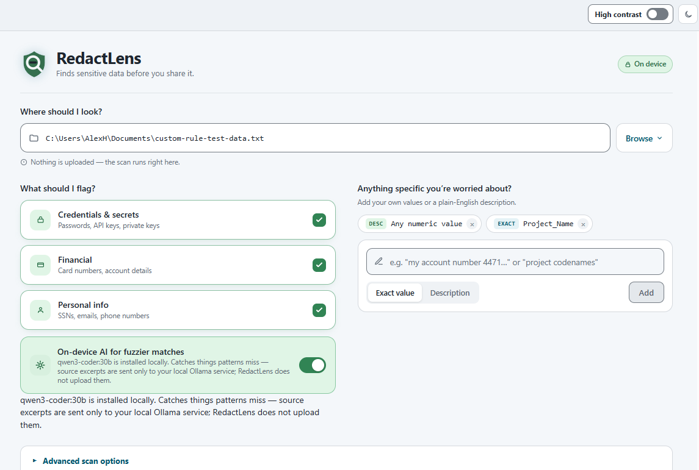
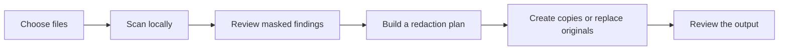
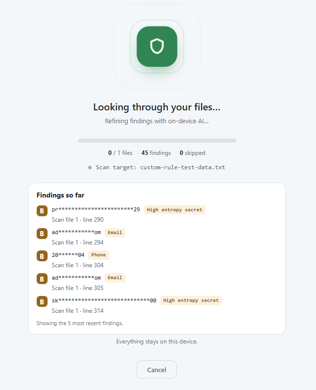
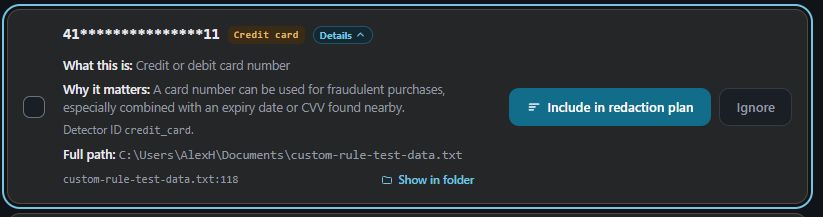
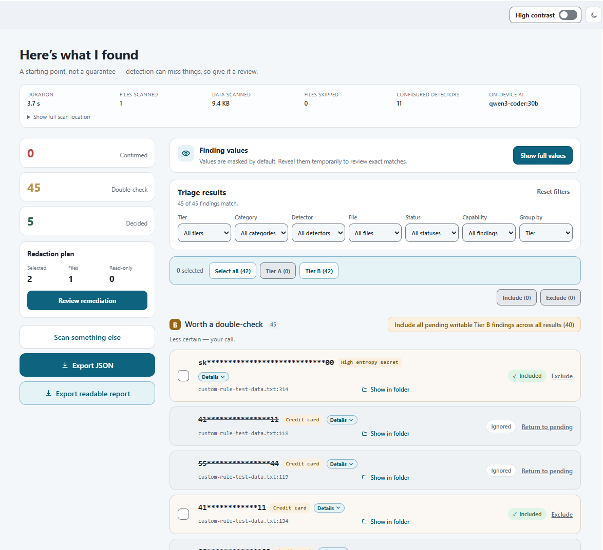
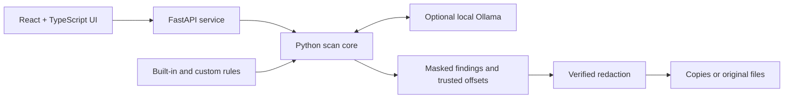

<p align="center">
  
</p>

<h1 align="center">RedactLens</h1>

<p align="center">
  <strong>Find sensitive data before you share it.</strong>
</p>

<p align="center">
  A privacy-first Windows app that scans files and folders for credentials, financial data,
  personal information, and anything else you tell it to look for.
</p>

<p align="center">
  
  
  
  
</p>

<p align="center">
  <a href="#getting-started"><strong>Getting started</strong></a>
</p>

RedactLens gives you a last line of defense before a file leaves your computer. Choose a file or
folder, review what it finds, and create redacted copies without uploading the originals to a
cloud service.

**No account. No upload. No cloud required.** Built-in scanning works on its own, while optional
local AI can add a second set of eyes for fuzzier matches.

<p align="center">
  
</p>

## In a minute, you can

- Scan one file, a whole folder, or a pasted path.
- Check credentials, financial data, personal information, and custom rules together.
- Separate strong matches from findings that deserve a second look.
- Keep sensitive values masked until you deliberately reveal them.
- Create redacted copies or explicitly replace the originals.
- Export a privacy-safe JSON or readable Markdown report.

> **Important**
>
> RedactLens is a review aid, not a guarantee that a file is safe to share. Detection can miss
> unusual, encrypted, obfuscated, image-only, or unsupported content. Always review the results
> and the final output.

## Table of contents

- [Why RedactLens?](#why-redactlens)
- [How it works](#how-it-works)
- [What it can find](#what-it-can-find)
- [Getting started](#getting-started)
- [Optional local AI](#optional-local-ai)
- [Review and redact safely](#review-and-redact-safely)
- [Supported files](#supported-files)
- [Privacy and security](#privacy-and-security)
- [Evidence and quality](#evidence-and-quality)
- [Troubleshooting](#troubleshooting)
- [Development](#development)
- [Contributing](#contributing)
- [License](#license)

---

## Why RedactLens?

Sensitive information is easy to miss. It can be buried in a spreadsheet cell, a speaker note,
an email attachment, a configuration file, or the middle of a large folder.

RedactLens is built around three ideas:

1. **Your files stay yours.** Scanning and redaction happen on the device.
2. **A finding should be understandable.** Results show what was found, why it matters, and where
   it came from.
3. **Changes should be deliberate.** RedactLens verifies the source before writing and lets you
   choose between a new copy and replacing the original.

| RedactLens                           | Typical cloud scanner        | Basic search tool |
| ------------------------------------ | ---------------------------- | ----------------- |
| Scans locally                        | Usually uploads content      | Local             |
| Understands structured documents     | Varies                       | Usually no        |
| Built-in and custom rules            | Often fixed or account-gated | Manual patterns   |
| Optional local AI                    | Often cloud-only             | No                |
| Guided redaction                     | Varies                       | No                |
| Light, dark, and high-contrast modes | Varies                       | Not applicable    |

## How it works

1. **Choose** a file or folder.
2. **Scan** with built-in categories, custom rules, and optional on-device AI.
3. **Review** masked findings in two clear tiers.
4. **Decide** what belongs in the redaction plan.
5. **Create** new redacted copies or explicitly replace the originals.
6. **Export** a report when you need an audit trail.



<p align="center">
  
</p>

## What it can find

RedactLens ships with detectors for:

- AWS access keys
- Connection strings
- Credit card numbers
- Email addresses
- High-entropy secrets
- JSON Web Tokens
- Password assignments
- Phone numbers
- Private-key headers
- US Social Security numbers

You can enable or disable the broader **Credentials & secrets**, **Financial**, and **Personal
info** categories for each scan.

### Add your own rules

RedactLens also accepts:

- **Exact values** for a known account number, identifier, codename, or other literal.
- **Plain-English descriptions** such as `employee IDs` or `project codenames`.

Exact-value rules work with the built-in scanner. Plain-English descriptions require the optional
local Ollama integration. The results identify the custom rule that found each value, so you are
not left guessing why it was flagged.

## Getting started

### Requirements

For the installed app:

- Windows 10 version 1809 (build 17763) or later, or Windows 11
- No Python, Node.js, account, or Ollama installation required

Ollama is optional. RedactLens's built-in rules work without it.

### Download and install RedactLens

GitHub can package the repository as a ZIP file without requiring a separate download link:

1. Select the green **Code** button near the top of this repository.
2. Select **Download ZIP**.
3. When the download finishes, right-click the ZIP file and select **Extract All**.
4. Open the extracted folder.
5. Close RedactLens if an older version is running.
6. Double-click **Install RedactLens.exe** and follow the setup wizard.
7. Launch RedactLens from the Start menu or desktop shortcut.
8. Choose a file or folder and start your first scan.

The included installer currently contains RedactLens 0.1.8.

Running a newer installer over an existing installation updates or repairs it. You do not need to
uninstall the old version first.

<details>
<summary><strong>Windows says the publisher is unknown</strong></summary>

The included repository installer is currently unsigned and can trigger Windows SmartScreen.

Only continue when you obtained the installer from a source you trust. Select **More info**, verify
that the filename and source are correct, and then select **Run anyway**.

</details>

## Optional local AI

RedactLens can use an Ollama model on the same device to help with fuzzy matches and
plain-English rules. RedactLens sends bounded source excerpts only to a verified local model over
a numeric loopback connection; it rejects remote or cloud-backed model references and does not
invoke Ollama web search.

### Set it up

1. [Download Ollama for Windows](https://ollama.com/download/windows) and run its installer.
2. Open PowerShell and download the recommended model:

   ```powershell
   ollama pull qwen3-coder:30b
   ```

3. Return to RedactLens and select **Check again**.
4. Open **Advanced scan options** to choose from models installed on your device.

`qwen3-coder:30b` is roughly a 19 GB download. You can choose another installed Ollama model, but
model choice can affect speed and detection quality. Use **Refresh models** after downloading a
new one. Ollama currently requires Windows 10 22H2 or newer; check its Windows documentation for
current hardware and operating-system requirements.

If Ollama is unavailable, RedactLens explains the problem and continues to offer its built-in
scan. See the [Ollama Windows documentation](https://docs.ollama.com/windows) for service and
installation help.

## Review and redact safely

### Results are made for decisions

- **Tier A - Confirmed sensitive:** a strong match that should still be reviewed.
- **Tier B - Worth a double-check:** a less certain match that needs your judgment.
- **Masked by default:** exact values remain hidden until you choose **Show full values**.
- **Expandable details:** each finding explains what detected it and why.
- **Useful location controls:** jump to the file in Explorer when manual review is needed.
- **Focused triage:** filter by tier, category, detector, file, status, or remediation capability.

Ignored findings stay ignored when you use the mass-selection controls.

<p align="center">
  
</p>

### Choose how the files change

When your plan is ready, RedactLens offers two paths:

| Choice                     | What happens                                          | Best for                                              |
| -------------------------- | ----------------------------------------------------- | ----------------------------------------------------- |
| **Create redacted copies** | Writes new files and leaves the originals untouched   | The safest default                                    |
| **Replace original files** | Rewrites the originals after an explicit confirmation | Controlled workflows where duplicates are undesirable |

Copy names preserve the real file extension:

```text
notes.txt        -> notes-auto-redacted-copy.txt
report.docx      -> report-auto-redacted-copy.docx
budget.xlsx      -> budget-auto-redacted-copy.xlsx
```

Before writing, RedactLens checks that the file still matches the version that was scanned.
Writes are staged atomically, conflicting output files are not silently overwritten, and formats
that cannot be rewritten safely are clearly marked **Read-only**.

<picture>
  <source media="(prefers-color-scheme: dark)" srcset="app/assets/screenshots/results-dark.png">
  <source media="(prefers-color-scheme: light)" srcset="app/assets/screenshots/results-light.png">
  
</picture>

## Supported files

| File type                                   | Scan | Automatic redaction |
| ------------------------------------------- | :--: | :-----------------: |
| Plain text, source, and configuration files | Yes  |         Yes         |
| DOCX, XLSX, PPTX                            | Yes  |         Yes         |
| ODT, ODS, ODP                               | Yes  |         Yes         |
| Digital-text PDF                            | Yes  | No - manual review  |
| EML email                                   | Yes  | No - manual review  |
| ZIP and bounded nested archives             | Yes  | No - manual review  |

RedactLens identifies many text files by content rather than relying only on their extension.

Current limits:

- Scanned or image-only PDFs need OCR before RedactLens can inspect their text.
- Password-protected or encrypted content must be decrypted locally first.
- Legacy Office formats such as `.doc`, `.xls`, and `.ppt` should be saved in a modern format.
- Outlook `.msg` files should be saved as `.eml`.
- Symlinks are not followed.
- Archive depth, file-size limits, extensions, ignored directories, timeouts, and worker counts are
  bounded and configurable in **Advanced scan options**.
- A root-level `.redactlensignore` file can exclude project-specific paths.
- Existing `.redactscoutignore` files remain supported for compatibility; rename them to
  `.redactlensignore` when convenient.

## Privacy and security

RedactLens is intentionally local-first:

- The service binds only to the loopback interface.
- Source files are not uploaded.
- Optional AI requests use a proxy-free, non-redirecting numeric-loopback connection to Ollama.
- Only model entries backed by verifiable local weight bytes are selectable. Before source text is
  sent, RedactLens checks Ollama's raw model details and rejects any model with a `remote_host` or
  `remote_model`; cloud references and renamed cloud aliases are excluded.
- Normal browser state receives masked findings rather than raw matches or trusted rewrite
  offsets.
- Sensitive values can be revealed temporarily for review.
- Files are re-verified immediately before redaction.
- Closing the desktop window shuts down the local service.

RedactLens trusts the signed-in Windows account and is not a sandbox for hostile files or hostile
local users. For the full boundary and abuse-case analysis, read the
[threat model](app/docs/threat-model.md).

For the project's complete data-handling statement and vulnerability-reporting process, read the
[privacy policy](docs/legal/PRIVACY.md) and [security policy](.github/SECURITY.md).

## Evidence and quality

RedactLens is tested beyond the happy path.

- **1,065 passing automated tests** in the current baseline: 853 Python and 212 frontend tests.
- **12 verification gates** cover tests, production builds, browser workflows, CLI behavior,
  formatting, linting, performance, and evaluation freshness.
- The release workflow smoke-tests the packaged app and a silent install/uninstall cycle.
- On the fixed built-in-detector holdout, RedactLens currently records **100% Tier A precision**,
  **100% any-tier recall**, and **0.841 overall F1**. These figures do not measure custom rules or
  Ollama-assisted detection.

Those evaluation figures describe the repository's fixed public holdout, not every real-world file.
Read the [evaluation report](app/tooling/eval/report.md) for the dataset, thresholds, methodology,
and explicit limitations.

## Troubleshooting

<details>
<summary><strong>Ollama is installed, but RedactLens cannot find it</strong></summary>

Ollama may still be starting after Windows signs in. Start it from the Start menu, wait a moment,
and select **Check again**. RedactLens will continue to scan with built-in rules while Ollama is
unavailable.

</details>

<details>
<summary><strong>Ollama is running, but the model is missing</strong></summary>

Run:

```powershell
ollama pull qwen3-coder:30b
```

Then select **Check again** or **Refresh models**. Only models installed on the device appear in
the selector.

</details>

<details>
<summary><strong>I installed an update, but the old app still appears</strong></summary>

Close every RedactLens window before running the new installer. Re-running the installer updates
the existing per-user installation; uninstalling first is normally unnecessary.

</details>

<details>
<summary><strong>A finding says Read-only</strong></summary>

RedactLens found sensitive content but cannot safely rewrite that format or location. Use **Show
in folder**, edit the source with the appropriate application, and scan it again.

</details>

<details>
<summary><strong>Why did RedactLens create a new filename?</strong></summary>

The default is a non-destructive copy. RedactLens inserts `-auto-redacted-copy` before the extension so
Windows and other applications still recognize the file type.

</details>

## Development

The installed app is self-contained. These requirements are only for source development:

- Python 3.11 or newer
- Node.js `^20.19` or `>=22.12`
- Windows

### Set up the repository

From the repository root:

```powershell
py -m venv .venv
Push-Location app
..\.venv\Scripts\python.exe -m pip install -r requirements-dev.txt
npm ci --prefix packages\frontend
Pop-Location
```

Launch the desktop app:

```powershell
.venv\Scripts\python.exe app\launch.py
```

Run the fabricated CLI demo:

```powershell
.venv\Scripts\python.exe -m redactlens_cli.main scan app\examples\demo
```

Run the complete quality baseline:

```powershell
.venv\Scripts\python.exe app\tooling\verify.py
```

The browser gate requires an installed Edge, Chrome, or Chromium. See the
[application development guide](app/README.md) for package responsibilities and release-build
details.

### Architecture



```text
.github/                         Windows CI and release workflows
app/
  packages/redactlens-core/     Detection, extraction, scoring, and redaction
  packages/api/                  Loopback API and trusted scan sessions
  packages/cli/                  Typer command-line interface
  packages/frontend/             React and TypeScript desktop interface
  tooling/                       Evaluation, packaging, and verification
  examples/demo/                 Fabricated sample files
  docs/                          Security documentation
Install RedactLens.exe          Current repository installer
```

## Contributing

Bug reports, accessibility feedback, detector ideas, documentation improvements, and focused pull
requests are welcome. The complete process, including the MIT contribution-licensing terms, is in
the [contribution guidelines](.github/CONTRIBUTING.md).

1. Search the [existing issues](../../issues) before opening a new one.
2. Describe the problem, expected behavior, and reproduction steps.
3. Use fabricated examples only. Never attach real credentials or personal data.
4. Run `app\tooling\verify.py` before submitting a code change.
5. Keep security-sensitive reports private until a safe disclosure path is agreed.

If RedactLens helps you catch something before it leaves your computer, consider starring the
repository. It helps other privacy-conscious users find the project.

### Further reading

- [Privacy policy](docs/legal/PRIVACY.md)
- [Security policy](.github/SECURITY.md)
- [Contribution guidelines](.github/CONTRIBUTING.md)
- [Encryption export review](docs/legal/EXPORT_COMPLIANCE.md)
- [Threat model](app/docs/threat-model.md)
- [Evaluation report](app/tooling/eval/report.md)
- [Windows CI GitHub Actions workflow](.github/workflows/windows-ci.yml)
- [Windows release-packaging GitHub Actions workflow](.github/workflows/windows-release.yml)

## License

RedactLens is available under the [MIT License](LICENSE). Third-party
components retain their own licenses. See the
[third-party inventory and source links](docs/legal/THIRD_PARTY_NOTICES.md) and the
[complete reproduced license texts](docs/legal/THIRD_PARTY_LICENSES.txt) included with
the Windows distribution.
